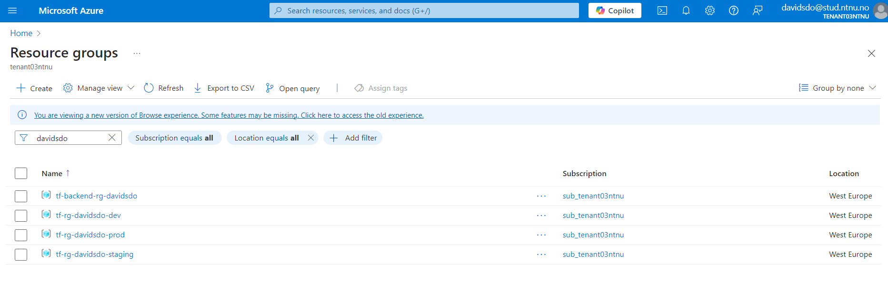
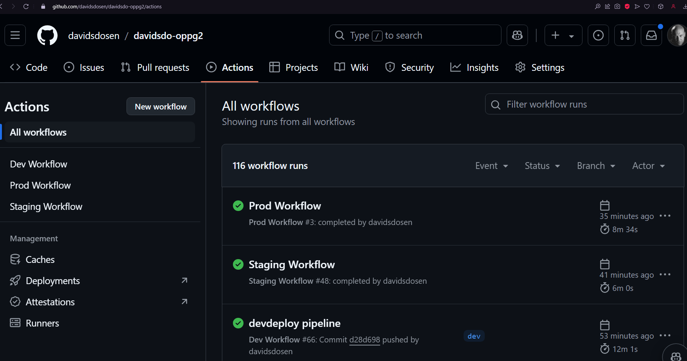
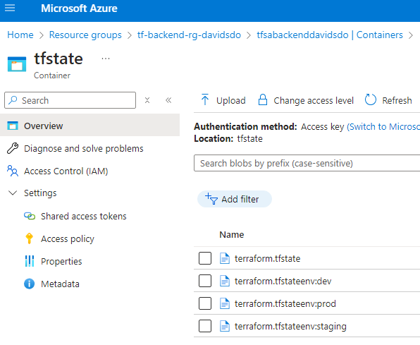
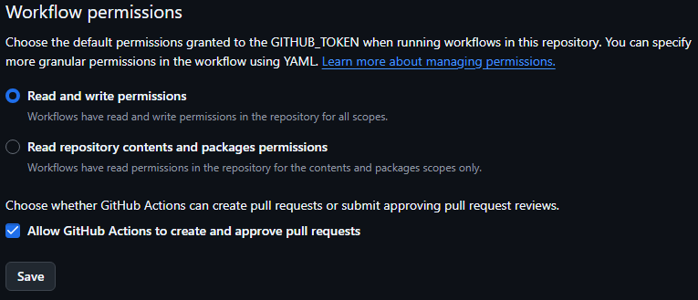

# davidsdo-oppg2 - IaC on Microsoft Azure using Terraform with CI/CD workflows
Repository for the 2nd obligatory assignment task: 
Terraform scripts for deploying and managing cloud infrastructure with Terraform to provision and manage resources declaratively with versioned configuration files with Github Actions
workflows that automatically run Terraform tests and apply configurations when changes are pushed/merged into specific branches.

## Repo secrets and GITHUB_TOKEN
This repository uses repository secrets (AZURE_CLIENT_ID, AZURE_CLIENT_SECRET, AZURE_CREDENTIALS, AZURE_SUBSCRIPTION_ID, AZURE_TENANT_ID) to authorize commands to the Microsoft Azure tenant. 

GITHUB_TOKEN is used to authorize workflows to perform automatic merging and pushing instead of ssh.

## Terraform Workspaces

This project uses a flexible terraform workspaces approach by using locals that automatically change infrastructure definitions and names based on which workspace you're in. The github CI/CD pipeline can automatically switch workspaces and deploy the appropriate infrastructure.

## Workflow explanation/solution
Pushing to dev activates the dev workflow that runs terraform validate, terraform format, tflint and tfsec checks in addition to plan. To deploy dev you need the keyword "devdeploy" in the commit message. This will deploy a dev envorinment with the dev specific tfvars file. For the automatic merge to the staging branch you need to add "pipeline" keyword in the commit message. You can only automerge if both the workflow is successful and you have the "pipeline" keyword. 

Finishing the dev workflow activates the staging workflow on the staging branch which deploys the infrastructure using the staging specific tfvars file. 

If the staging workflow completes, the prod workflow automatically activates but before you can continue the workflow and run the jobs to deploy the prod infrastructure, the prod envorinment has a manual approval setting set to on which will pause the prod workflow at the start and require you to manually approve it.

Each workflow changes the terraform workspace to the correct one. The .yml workflow files can be found in .github/workflows

## Remote .tfstate storage
This project has a remote backend storage set up to automatically store the .tfstate files for all three envorinments (dev, staging and prod) in the same tf-backend-rg-davidsdo storage group.

## Pre-requisites
Your repository must enable read and write workflow permissions in addition to allowing and github actions to create and approve pull requests.

## General Pre-requisites
Before you can use these Terraform scripts, ensure you have the following installed and configured:

- **Terraform:** You should have the latest version of Terraform installed on your system. Visit [Terraform's website](https://www.terraform.io/downloads.html) for download and installation instructions.
- **Cloud Provider CLI:** Since these scripts are designed for use with the cloud provider Microsoft Azure, make sure you have the respective CLI installed and authenticated on your local machine.
- **Git:** As we're using Git for version control, make sure you have it installed. Refer to [Git's website](https://git-scm.com/book/en/v2/Getting-Started-Installing-Git) for installation instructions.

## How to use terraform scripts

1. **Clone the Repository:**
git clone https://github.com/davidsdosen/davidsdo-oppg2.git
   
2. **Initialize Terraform:**
Run "terraform init" command to initialize Terraform, it will download necessary providers and modules.

3. **Create a Terraform Plan:** (Optional)
To see what Terraform will do before actually making any changes, run: "terraform plan"

4. **Apply the Terraform Configuration:**
To apply the configuration and create the resources, run: "terraform apply" And you'll be prompted to confirm the action before Terraform proceeds to make any changes to your infrastructure.

5. **Inspect State:**
After applying, you can inspect the current state of your resources using: "terraform show"

6. **Destroy Infrastructure:**
When you no longer need the resources, you can destroy them with: "terraform destroy" again, you'll be prompted to confirm the action before Terraform deletes anything.